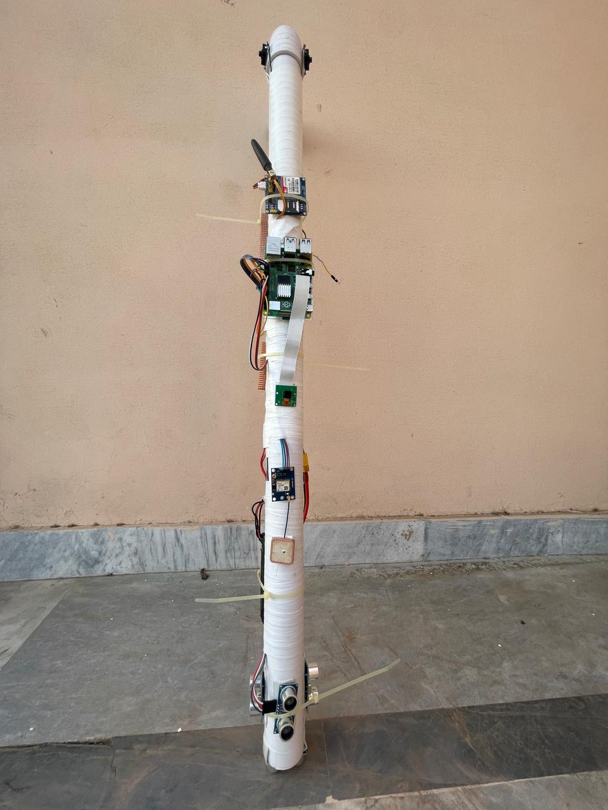

🦯 BlindAssist
Machine Learning Enhanced Object Recognition, GPS Tracking, and Speech Feedback

Final Year Project (FYP)
Lahore Garrison University
Batch: 2024

📌 Project Overview

Over 284 million people worldwide live with visual impairments, facing daily challenges in independent navigation and personal safety. While several assistive tools exist, many lack real-time intelligence, environment awareness, and integrated safety mechanisms.

BlindAssist is a hardware–software integrated smart assistive system designed to enhance mobility and safety for visually impaired individuals. By combining machine learning–based object recognition, ultrasonic obstacle detection, GPS navigation, and speech feedback, the system provides real-time guidance and emergency support through a smart stick interface.

❗ Problem Statement

Existing assistive technologies for visually impaired individuals often lack real-time assistance and comprehensive functionality, leaving users vulnerable in dynamic environments. The absence of intelligent obstacle detection, object recognition, and navigation support increases dependency and safety risks.

The BlindAssist project addresses these challenges by integrating machine learning, GPS tracking, and speech feedback into a single intelligent system. The aim is to empower visually impaired individuals, bridge accessibility gaps, and foster inclusivity through innovative assistive technology.

💡 Solution Overview

BlindAssist functions as a smart assistive stick that continuously monitors the surrounding environment and provides audio-based guidance to the user.

Key Features

🔍 Real-time obstacle detection using ultrasonic sensors

🧠 Machine learning–based object recognition via camera input

🗺️ GPS-based navigation and location tracking

🔊 Speech feedback system for hands-free interaction

🚨 Emergency alert mechanism using GSM communication

🏗️ System Architecture & Workflow

The following diagram illustrates the complete workflow of the BlindAssist system, including user interaction, sensor processing, object recognition, navigation assistance, and emergency alert handling.

🦯 Hardware Prototype (Smart Assistive Stick)

The physical prototype integrates sensing, processing, and communication modules into a compact smart stick suitable for real-world usage.

🔌 Circuit Design & Module Connections

The circuit diagram shows the interconnection between the Raspberry Pi, ultrasonic sensors, camera module, GPS, GSM module, and power supply.

🧩 Hardware Components

Raspberry Pi 4 Model B – Central processing and control unit

Ultrasonic Sensors (HC-SR04) – Obstacle detection

Raspberry Pi Camera Module v2 – Image capture for object recognition

GPS Neo-6M Module – Real-time location tracking

GSM SIM900A Module – Emergency alert communication

Li-Po Battery & LM7805 Voltage Regulator – Stable power supply

Push Buttons – Emergency triggering and user interaction

💻 Software Tools & Libraries

Python – Primary programming language

RPi.GPIO – GPIO pin interfacing

OpenCV – Image processing and object recognition

TensorFlow Lite – Lightweight ML inference on Raspberry Pi

Picamera2 – Camera interface for image capture

pyttsx3 – Text-to-speech conversion

pySerial – Communication with GPS and GSM modules

⚙️ System Evaluation & Results

The solution was rigorously tested to evaluate its effectiveness across core functionalities.

🔍 Performance Summary

Obstacle Detection:
Ultrasonic sensors achieved high accuracy with an error margin of ±1 cm, ensuring reliable real-time alerts.

Object Recognition:
The machine learning model achieved an average accuracy of 92%, enabling effective identification and avoidance of obstacles.

Navigation Assistance:
GPS module provided accurate location tracking within a 3-meter radius, supporting dependable wayfinding.

Emergency Alerts:
GSM module successfully transmitted emergency alerts within 8 seconds, ensuring timely notification to caregivers or emergency contacts.

These results confirm that BlindAssist significantly enhances navigation safety and situational awareness for visually impaired users.

📁 Project Documentation

Detailed project documents are available in the /docs directory:

📄 Software Requirements Specification (SRS)

📄 Project Proposal

📄 Final Project Report

📄 Complete Technical Documentation

🚀 Future Enhancements

Integration of advanced deep learning models for improved object classification

Mobile application for caregiver monitoring

Cloud-based location tracking and analytics

Hardware miniaturization and power optimization

Multilingual speech feedback support

🤝 Conclusion

BlindAssist demonstrates the effective application of machine learning, embedded systems, and assistive technology to solve a real-world accessibility problem. The project highlights how intelligent systems can improve independence, safety, and quality of life for visually impaired individuals.
